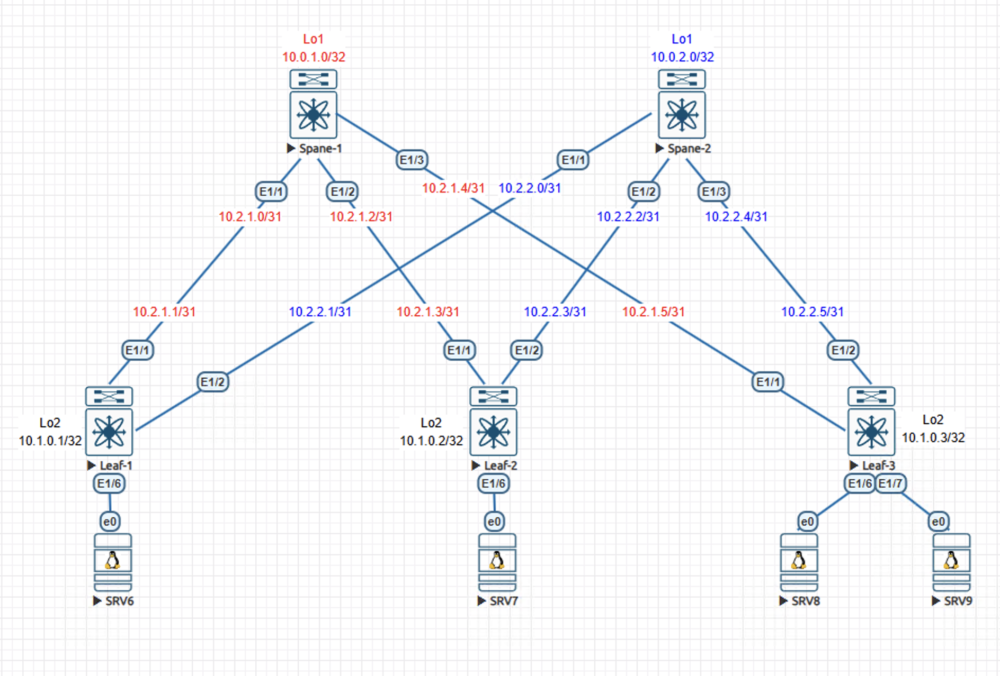

# Домашнее задание №1
## Основы проектирования сети

### Задание:
- Собрать схему CLOS;
- Распределить адресное пространство.

## Выполнение:

### Собранная схема сети



### Таблица адресов
| hostname | interface |   IP/MASK   | Description |
| :------: | :-------: | :----------: | :---------: |
|  leaf-1  | Loopback2 | 10.1.0.1 /32 |            |
|  leaf-1  | Ethernet1 | 10.2.1.1 /31 | UpLink Spine-1-e1/1 |
|  leaf-1  | Ethernet2 | 10.2.2.1 /31 | UpLink Spine-2-e1/1 |
|          |          |              |            |
|  leaf-2  | Loopback2 | 10.1.0.2 /32 |            |
|  leaf-2  | Ethernet1 | 10.2.1.3 /31 | UpLink Spine-1-e1/2 |
|  leaf-2  | Ethernet2 | 10.2.2.3 /31 | UpLink Spine-2-e1/2 |
|          |          |              |            |
|  leaf-3  | Loopback2 | 10.1.0.3 /32 |            |
|  leaf-3  | Ethernet1 | 10.2.1.5 /31 | UpLink Spine-1-e1/3 |
|  leaf-3  | Ethernet2 | 10.2.2.5 /31 | UpLink Spine-2-e1/3 |
|          |          |              |            |
| spine-1 | Loopback1 | 10.0.1.0/32 |            |
| spine-1 | Ethernet1 | 10.2.1.0/31 |  DownLink Leaf-1-e1/1  |
| spine-1 | Ethernet2 | 10.2.1.2/31 |  DownLink Leaf-2-e1/1  |
| spine-1 | Ethernet3 | 10.2.1.4/31 |  DownLink Leaf-3-e1/1  |
|          |          |              |            |
| spine-2 | Loopback1 | 10.0.2.0/32 |            |
| spine-2 | Ethernet1 | 10.2.2.0/31 |  DownLink Leaf-2-e1/1  |
| spine-2 | Ethernet2 | 10.2.2.2/31 |  DownLink Leaf-2-e1/1  |
| spine-2 | Ethernet3 | 10.2.2.4/31 |  DownLink Leaf-2-e1/1  |

### Конфигурация устройств:

#### - [Spine-1](Config/Spine-1)
```
hostname Spine-1

interface Ethernet1/1
  description -- DownLink Leaf-1-e1/1
  no switchport
  ip address 10.2.1.0/31
  no shutdown

interface Ethernet1/2
  description -- DownLink Leaf-2-e1/1
  no switchport
  ip address 10.2.1.2/31
  no shutdown

interface Ethernet1/3
  description -- DownLink Leaf-3-e1/1
  no switchport
  ip address 10.2.1.4/31
  no shutdown

interface loopback1
  ip address 10.0.1.0/32

```

#### - [Spine-2](Config/Spine-2)

```
hostname Spine-2

interface Ethernet1/1
  description -- DownLink Leaf-1-e1/1
  no switchport
  ip address 10.2.2.0/31
  no shutdown

interface Ethernet1/2
  description -- DownLink Leaf-2-e1/1
  no switchport
  ip address 10.2.2.2/31
  no shutdown

interface Ethernet1/3
  description -- DownLink Leaf-3-e1/1
  no switchport
  ip address 10.2.2.4/31
  no shutdown

interface loopback1
  ip address 10.0.2.0/3

```

#### - [Leaf-1](Config/Leaf-1)

```

hostname Leaf-1

interface Ethernet1
   description to-spine-1
   no switchport
   ip address 10.2.1.1/31

interface Ethernet2
   description to-spine-2
   no switchport
   ip address 10.2.2.1/31
   
interface loopback2
  ip address 10.1.0.1/32

```

#### - [Leaf-2](Config/Leaf-2)

```

hostname Leaf-2

interface Ethernet1/1
  description -- UpLink Spine-1-e1/2
  no switchport
  ip address 10.2.1.3/31
  no shutdown

interface Ethernet1/2
  description -- UpLink Spine-2-e1/2
  no switchport
  ip address 10.2.2.3/31
  no shutdown

interface loopback2
  ip address 10.1.0.2/32

```

#### - [Leaf-3](Config/Leaf-3)

```

hostname Leaf-3

interface Ethernet1/1
  description -- UpLink Spine-1-e1/3
  no switchport
  ip address 10.2.1.5/31
  no shutdown

interface Ethernet1/2
  description -- UpLink Spine-2-e1/3
  no switchport
  ip address 10.2.2.5/31
  no shutdown

interface loopback2
  ip address 10.1.0.3/32

```
### Проверка связности:

- Spine-1
```
Spine-1# ping 10.2.1.1
PING 10.2.1.1 (10.2.1.1): 56 data bytes
36 bytes from 10.2.1.0: Destination Host Unreachable
Request 0 timed out
64 bytes from 10.2.1.1: icmp_seq=1 ttl=254 time=22.056 ms
64 bytes from 10.2.1.1: icmp_seq=2 ttl=254 time=3.428 ms
64 bytes from 10.2.1.1: icmp_seq=3 ttl=254 time=1.772 ms
64 bytes from 10.2.1.1: icmp_seq=4 ttl=254 time=1.567 ms

--- 10.2.1.1 ping statistics ---
5 packets transmitted, 4 packets received, 20.00% packet loss
round-trip min/avg/max = 1.567/7.205/22.056 ms
```

```
Spine-1# ping 10.2.1.3
PING 10.2.1.3 (10.2.1.3): 56 data bytes
36 bytes from 10.2.1.2: Destination Host Unreachable
Request 0 timed out
64 bytes from 10.2.1.3: icmp_seq=1 ttl=254 time=8.566 ms
64 bytes from 10.2.1.3: icmp_seq=2 ttl=254 time=3.081 ms
64 bytes from 10.2.1.3: icmp_seq=3 ttl=254 time=3.011 ms
64 bytes from 10.2.1.3: icmp_seq=4 ttl=254 time=2.387 ms

--- 10.2.1.3 ping statistics ---
5 packets transmitted, 4 packets received, 20.00% packet loss
round-trip min/avg/max = 2.387/4.261/8.566 ms

```

```
Spine-1# ping 10.2.1.5
PING 10.2.1.5 (10.2.1.5): 56 data bytes
36 bytes from 10.2.1.4: Destination Host Unreachable
Request 0 timed out
64 bytes from 10.2.1.5: icmp_seq=1 ttl=254 time=18.667 ms
64 bytes from 10.2.1.5: icmp_seq=2 ttl=254 time=2.015 ms
64 bytes from 10.2.1.5: icmp_seq=3 ttl=254 time=2.037 ms
64 bytes from 10.2.1.5: icmp_seq=4 ttl=254 time=1.836 ms

--- 10.2.1.5 ping statistics ---
5 packets transmitted, 4 packets received, 20.00% packet loss
round-trip min/avg/max = 1.836/6.138/18.667 ms

```

- Spine-2
```
Spine-2# ping 10.2.2.1
PING 10.2.2.1 (10.2.2.1): 56 data bytes
36 bytes from 10.2.2.0: Destination Host Unreachable
Request 0 timed out
64 bytes from 10.2.2.1: icmp_seq=1 ttl=254 time=11.997 ms
64 bytes from 10.2.2.1: icmp_seq=2 ttl=254 time=1.632 ms
64 bytes from 10.2.2.1: icmp_seq=3 ttl=254 time=1.41 ms
64 bytes from 10.2.2.1: icmp_seq=4 ttl=254 time=1.979 ms

--- 10.2.2.1 ping statistics ---
5 packets transmitted, 4 packets received, 20.00% packet loss
round-trip min/avg/max = 1.41/4.254/11.997 ms

```

```
Spine-2# ping 10.2.2.3
PING 10.2.2.3 (10.2.2.3): 56 data bytes
36 bytes from 10.2.2.2: Destination Host Unreachable
Request 0 timed out
64 bytes from 10.2.2.3: icmp_seq=1 ttl=254 time=25.77 ms
64 bytes from 10.2.2.3: icmp_seq=2 ttl=254 time=2.325 ms
64 bytes from 10.2.2.3: icmp_seq=3 ttl=254 time=2.459 ms
64 bytes from 10.2.2.3: icmp_seq=4 ttl=254 time=2.274 ms

--- 10.2.2.3 ping statistics ---
5 packets transmitted, 4 packets received, 20.00% packet loss
round-trip min/avg/max = 2.274/8.206/25.77 ms

```

```
Spine-2# ping 10.2.2.5
PING 10.2.2.5 (10.2.2.5): 56 data bytes
36 bytes from 10.2.2.4: Destination Host Unreachable
Request 0 timed out
64 bytes from 10.2.2.5: icmp_seq=1 ttl=254 time=4.725 ms
64 bytes from 10.2.2.5: icmp_seq=2 ttl=254 time=1.47 ms
64 bytes from 10.2.2.5: icmp_seq=3 ttl=254 time=1.331 ms
64 bytes from 10.2.2.5: icmp_seq=4 ttl=254 time=2.319 ms

--- 10.2.2.5 ping statistics ---
5 packets transmitted, 4 packets received, 20.00% packet loss
round-trip min/avg/max = 1.331/2.461/4.725 ms

```


