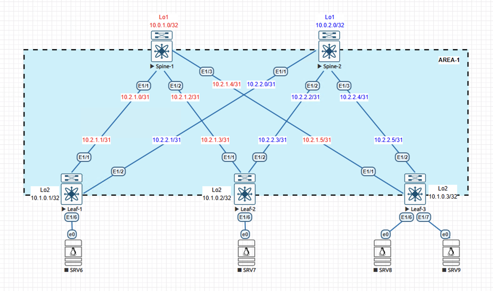

# Домашнее задание №2
## Underlay. OSPF

### Задание:
- Настроите OSPF в Underlay сети, для IP связанности между всеми сетевыми устройствами;
- Убедиться в наличии IP связанности между устройствами в OSFP домене.

## Выполнение:

### Собранная схема сети



### Конфигурация устройств:

#### - [Spine-1](Config/Spine-1)
```
hostname Spine-1
feature ospf

ip prefix-list REDISTRIBUTION-Lo seq 5 permit 10.0.1.0/32
route-map REDISTRIBUTION-Lo permit 10
  match ip address prefix-list REDISTRIBUTION-Lo

interface Ethernet1/1
  description -- DownLink Leaf-1-e1/1
  no switchport
  mtu 9216
  ip address 10.2.1.0/31
  ip ospf authentication message-digest
  ip ospf authentication-key 3 7608c1e3a3cce60d
  ip ospf network point-to-point
  no ip ospf passive-interface
  ip router ospf 1 area 0.0.0.1
  no shutdown

interface Ethernet1/2
  description -- DownLink Leaf-2-e1/1
  no switchport
  mtu 9216
  ip address 10.2.1.2/31
  ip ospf authentication message-digest
  ip ospf authentication-key 3 2f4bca7f2f1a5a74
  ip ospf network point-to-point
  no ip ospf passive-interface
  ip router ospf 1 area 0.0.0.1
  no shutdown

interface Ethernet1/3
  description -- DownLink Leaf-3-e1/1
  no switchport
  mtu 9216
  ip address 10.2.1.4/31
  ip ospf authentication message-digest
  ip ospf authentication-key 3 416da2f5c0183535
  ip ospf network point-to-point
  no ip ospf passive-interface
  ip router ospf 1 area 0.0.0.1
  no shutdown

interface loopback1
  ip address 10.0.1.0/32

router ospf 1
  router-id 10.0.1.0
  redistribute direct route-map REDISTRIBUTION-Lo
  area 0.0.0.1 authentication
  passive-interface default
  
```

#### - [Spine-2](Config/Spine-2)

```
hostname Spine-2
feature ospf

ip prefix-list REDISTRIBUTION-Lo seq 5 permit 10.0.2.0/32
route-map REDISTRIBUTION-Lo permit 10
  match ip address prefix-list REDISTRIBUTION-Lo


interface Ethernet1/1
  description -- DownLink Leaf-1-e1/1
  no switchport
  mtu 9216
  ip address 10.2.2.0/31
  ip ospf authentication message-digest
  ip ospf authentication-key 3 949dd1cb6f31a477
  ip ospf network point-to-point
  no ip ospf passive-interface
  ip router ospf 1 area 0.0.0.1
  no shutdown

interface Ethernet1/2
  description -- DownLink Leaf-2-e1/1
  no switchport
  mtu 9216
  ip address 10.2.2.2/31
  ip ospf authentication message-digest
  ip ospf authentication-key 3 e5a7824f75d56d59
  ip ospf network point-to-point
  no ip ospf passive-interface
  ip router ospf 1 area 0.0.0.1
  no shutdown

interface Ethernet1/3
  description -- DownLink Leaf-3-e1/1
  no switchport
  mtu 9216
  ip address 10.2.2.4/31
  ip ospf authentication message-digest
  ip ospf authentication-key 3 ace755d546b24bdb
  ip ospf network point-to-point
  no ip ospf passive-interface
  ip router ospf 1 area 0.0.0.1
  no shutdown

interface loopback1
  ip address 10.0.2.0/3

router ospf 1
  router-id 10.0.2.0
  redistribute direct route-map REDISTRIBUTION-Lo
  area 0.0.0.1 authentication
  passive-interface default

```

#### - [Leaf-1](Config/Leaf-1)

```

hostname Leaf-1
feature ospf

ip prefix-list REDISTRIBUTION-Lo seq 5 permit 10.1.0.1/32
route-map REDISTRIBUTION-Lo permit 10
  match ip address prefix-list REDISTRIBUTION-Lo

interface Ethernet1/1
  description -- UpLink Spine-1-e1/1
  no switchport
  mtu 9216
  ip address 10.2.1.1/31
  ip ospf authentication message-digest
  ip ospf authentication-key 3 7608c1e3a3cce60d
  ip ospf network point-to-point
  no ip ospf passive-interface
  ip router ospf 1 area 0.0.0.1
  no shutdown

interface Ethernet1/2
  description -- DownLink Spine-2-e1/1
  no switchport
  mtu 9216
  ip address 10.2.2.1/31
  ip ospf authentication message-digest
  ip ospf authentication-key 3 949dd1cb6f31a477
  ip ospf network point-to-point
  no ip ospf passive-interface
  ip router ospf 1 area 0.0.0.1
  no shutdown
   
interface loopback2
  ip address 10.1.0.1/32
  
router ospf 1
  router-id 10.1.0.1
  redistribute direct route-map REDISTRIBUTION-Lo
  area 0.0.0.1 authentication
  passive-interface default
```

#### - [Leaf-2](Config/Leaf-2)

```

hostname Leaf-2
feature ospf

ip prefix-list REDISTRIBUTION-Lo seq 5 permit 10.1.0.2/32
route-map REDISTRIBUTION-Lo permit 10
  match ip address prefix-list REDISTRIBUTION-Lo

interface Ethernet1/1
  description -- UpLink Spine-1-e1/2
  no switchport
  mtu 9216
  ip address 10.2.1.3/31
  ip ospf authentication message-digest
  ip ospf authentication-key 3 2f4bca7f2f1a5a74
  ip ospf network point-to-point
  no ip ospf passive-interface
  ip router ospf 1 area 0.0.0.1
  no shutdown

interface Ethernet1/2
  description -- DownLink Spine-2-e1/2
  no switchport
  mtu 9216
  ip address 10.2.2.3/31
  ip ospf authentication message-digest
  ip ospf authentication-key 3 05bca8216e4a5a6e
  ip ospf network point-to-point
  no ip ospf passive-interface
  ip router ospf 1 area 0.0.0.1
  no shutdown

interface loopback2
  ip address 10.1.0.2/32

router ospf 1
  router-id 10.1.0.2
  redistribute direct route-map REDISTRIBUTION-Lo
  area 0.0.0.1 authentication
  passive-interface default

```

#### - [Leaf-3](Config/Leaf-3)

```

hostname Leaf-3
feature ospf

ip prefix-list REDISTRIBUTION-Lo seq 5 permit 10.1.0.2/32
route-map REDISTRIBUTION-Lo permit 10
  match ip address prefix-list REDISTRIBUTION-Lo

interface Ethernet1/1
  description -- UpLink Spine-1-e1/3
  no switchport
  mtu 9216
  ip address 10.2.1.5/31
  ip ospf authentication message-digest
  ip ospf authentication-key 3 416da2f5c0183535
  ip ospf network point-to-point
  no ip ospf passive-interface
  ip router ospf 1 area 0.0.0.1
  no shutdown

interface Ethernet1/2
  description -- DownLink Spine-2-e1/3
  no switchport
  mtu 9216
  ip address 10.2.2.5/31
  ip ospf authentication message-digest
  ip ospf authentication-key 3 b3a318aef685593c
  ip ospf network point-to-point
  no ip ospf passive-interface
  ip router ospf 1 area 0.0.0.1
  no shutdown

interface loopback2
  ip address 10.1.0.3/32

router ospf 1
  router-id 10.1.0.3
  redistribute direct route-map REDISTRIBUTION-Lo
  area 0.0.0.1 authentication
  passive-interface default

```

### Таблицы Маршрутизации и Соседства:
- Spine-1
```
Spine-1# sho ip ospf neighbors
 OSPF Process ID 1 VRF default
 Total number of neighbors: 3
 Neighbor ID     Pri State            Up Time  Address         Interface
 10.1.0.1          1 FULL/ -          00:04:23 10.2.1.1        Eth1/1
 10.1.0.2          1 FULL/ -          00:04:09 10.2.1.3        Eth1/2
 10.1.0.3          1 FULL/ -          00:03:59 10.2.1.5        Eth1/3
```

```
Spine-1# sho ip route ospf-1
IP Route Table for VRF "default"
'*' denotes best ucast next-hop
'**' denotes best mcast next-hop
'[x/y]' denotes [preference/metric]
'%<string>' in via output denotes VRF <string>

10.0.2.0/32, ubest/mbest: 3/0
    *via 10.2.1.1, Eth1/1, [110/20], 00:05:01, ospf-1, type-2
    *via 10.2.1.3, Eth1/2, [110/20], 00:04:50, ospf-1, type-2
    *via 10.2.1.5, Eth1/3, [110/20], 00:04:33, ospf-1, type-2
10.1.0.1/32, ubest/mbest: 1/0
    *via 10.2.1.1, Eth1/1, [110/20], 00:05:02, ospf-1, type-2
10.1.0.2/32, ubest/mbest: 1/0
    *via 10.2.1.3, Eth1/2, [110/20], 00:04:50, ospf-1, type-2
10.1.0.3/32, ubest/mbest: 1/0
    *via 10.2.1.5, Eth1/3, [110/20], 00:04:38, ospf-1, type-2
10.2.2.0/31, ubest/mbest: 1/0
    *via 10.2.1.1, Eth1/1, [110/80], 00:05:02, ospf-1, intra
10.2.2.2/31, ubest/mbest: 1/0
    *via 10.2.1.3, Eth1/2, [110/80], 00:04:50, ospf-1, intra
10.2.2.4/31, ubest/mbest: 1/0
    *via 10.2.1.5, Eth1/3, [110/80], 00:04:38, ospf-1, intra

```

- Spine-2
```
Spine-2# show ip ospf neighbors
 OSPF Process ID 1 VRF default
 Total number of neighbors: 3
 Neighbor ID     Pri State            Up Time  Address         Interface
 10.1.0.1          1 FULL/ -          00:07:40 10.2.2.1        Eth1/1
 10.1.0.2          1 FULL/ -          00:07:29 10.2.2.3        Eth1/2
 10.1.0.3          1 FULL/ -          00:07:11 10.2.2.5        Eth1/3

```

```
Spine-2# show ip route ospf-1
IP Route Table for VRF "default"
'*' denotes best ucast next-hop
'**' denotes best mcast next-hop
'[x/y]' denotes [preference/metric]
'%<string>' in via output denotes VRF <string>

10.0.1.0/32, ubest/mbest: 3/0
    *via 10.2.2.1, Eth1/1, [110/20], 00:07:51, ospf-1, type-2
    *via 10.2.2.3, Eth1/2, [110/20], 00:07:40, ospf-1, type-2
    *via 10.2.2.5, Eth1/3, [110/20], 00:07:23, ospf-1, type-2
10.1.0.1/32, ubest/mbest: 1/0
    *via 10.2.2.1, Eth1/1, [110/20], 00:07:51, ospf-1, type-2
10.1.0.2/32, ubest/mbest: 1/0
    *via 10.2.2.3, Eth1/2, [110/20], 00:07:44, ospf-1, type-2
10.1.0.3/32, ubest/mbest: 1/0
    *via 10.2.2.5, Eth1/3, [110/20], 00:07:23, ospf-1, type-2
10.2.1.0/31, ubest/mbest: 1/0
    *via 10.2.2.1, Eth1/1, [110/80], 00:07:51, ospf-1, intra
10.2.1.2/31, ubest/mbest: 1/0
    *via 10.2.2.3, Eth1/2, [110/80], 00:07:44, ospf-1, intra
10.2.1.4/31, ubest/mbest: 1/0
    *via 10.2.2.5, Eth1/3, [110/80], 00:07:23, ospf-1, intra

```

- Leaf-1
```
Leaf-1# sho ip ospf neighbors
 OSPF Process ID 1 VRF default
 Total number of neighbors: 2
 Neighbor ID     Pri State            Up Time  Address         Interface
 10.0.1.0          1 FULL/ -          00:18:10 10.2.1.0        Eth1/1
 10.0.2.0          1 FULL/ -          00:18:10 10.2.2.0        Eth1/2
```

```
Leaf-1# sho ip route ospf-1
IP Route Table for VRF "default"
'*' denotes best ucast next-hop
'**' denotes best mcast next-hop
'[x/y]' denotes [preference/metric]
'%<string>' in via output denotes VRF <string>

10.0.1.0/32, ubest/mbest: 1/0
    *via 10.2.1.0, Eth1/1, [110/20], 00:18:24, ospf-1, type-2
10.0.2.0/32, ubest/mbest: 1/0
    *via 10.2.2.0, Eth1/2, [110/20], 00:18:23, ospf-1, type-2
10.1.0.2/32, ubest/mbest: 2/0
    *via 10.2.1.0, Eth1/1, [110/20], 00:18:13, ospf-1, type-2
    *via 10.2.2.0, Eth1/2, [110/20], 00:18:16, ospf-1, type-2
10.1.0.3/32, ubest/mbest: 2/0
    *via 10.2.1.0, Eth1/1, [110/20], 00:18:01, ospf-1, type-2
    *via 10.2.2.0, Eth1/2, [110/20], 00:17:55, ospf-1, type-2
10.2.1.2/31, ubest/mbest: 1/0
    *via 10.2.1.0, Eth1/1, [110/80], 00:18:24, ospf-1, intra
10.2.1.4/31, ubest/mbest: 1/0
    *via 10.2.1.0, Eth1/1, [110/80], 00:18:25, ospf-1, intra
10.2.2.2/31, ubest/mbest: 1/0
    *via 10.2.2.0, Eth1/2, [110/80], 00:18:23, ospf-1, intra
10.2.2.4/31, ubest/mbest: 1/0
    *via 10.2.2.0, Eth1/2, [110/80], 00:18:23, ospf-1, intra
```

- Leaf-2
```
Leaf-2# show ip ospf neighbors
 OSPF Process ID 1 VRF default
 Total number of neighbors: 2
 Neighbor ID     Pri State            Up Time  Address         Interface
 10.0.1.0          1 FULL/ -          00:23:53 10.2.1.2        Eth1/1
 10.0.2.0          1 FULL/ -          00:23:55 10.2.2.2        Eth1/2

```

```
Leaf-2# sho ip route ospf-1
IP Route Table for VRF "default"
'*' denotes best ucast next-hop
'**' denotes best mcast next-hop
'[x/y]' denotes [preference/metric]
'%<string>' in via output denotes VRF <string>

10.0.1.0/32, ubest/mbest: 1/0
    *via 10.2.1.2, Eth1/1, [110/20], 00:24:13, ospf-1, type-2
10.0.2.0/32, ubest/mbest: 1/0
    *via 10.2.2.2, Eth1/2, [110/20], 00:24:13, ospf-1, type-2
10.1.0.1/32, ubest/mbest: 2/0
    *via 10.2.1.2, Eth1/1, [110/20], 00:24:13, ospf-1, type-2
    *via 10.2.2.2, Eth1/2, [110/20], 00:24:13, ospf-1, type-2
10.1.0.3/32, ubest/mbest: 2/0
    *via 10.2.1.2, Eth1/1, [110/20], 00:23:57, ospf-1, type-2
    *via 10.2.2.2, Eth1/2, [110/20], 00:23:52, ospf-1, type-2
10.2.1.0/31, ubest/mbest: 1/0
    *via 10.2.1.2, Eth1/1, [110/80], 00:24:13, ospf-1, intra
10.2.1.4/31, ubest/mbest: 1/0
    *via 10.2.1.2, Eth1/1, [110/80], 00:24:13, ospf-1, intra
10.2.2.0/31, ubest/mbest: 1/0
    *via 10.2.2.2, Eth1/2, [110/80], 00:24:13, ospf-1, intra
10.2.2.4/31, ubest/mbest: 1/0
    *via 10.2.2.2, Eth1/2, [110/80], 00:24:13, ospf-1, intra
```

- Leaf-3
```
Leaf-3# show ip ospf neighbors
 OSPF Process ID 1 VRF default
 Total number of neighbors: 2
 Neighbor ID     Pri State            Up Time  Address         Interface
 10.0.1.0          1 FULL/ -          00:24:50 10.2.1.4        Eth1/1
 10.0.2.0          1 FULL/ -          00:24:44 10.2.2.4        Eth1/2

```

```
Leaf-3# show ip route ospf-1
IP Route Table for VRF "default"
'*' denotes best ucast next-hop
'**' denotes best mcast next-hop
'[x/y]' denotes [preference/metric]
'%<string>' in via output denotes VRF <string>

10.0.1.0/32, ubest/mbest: 1/0
    *via 10.2.1.4, Eth1/1, [110/20], 00:25:06, ospf-1, type-2
10.0.2.0/32, ubest/mbest: 1/0
    *via 10.2.2.4, Eth1/2, [110/20], 00:25:05, ospf-1, type-2
10.1.0.1/32, ubest/mbest: 2/0
    *via 10.2.1.4, Eth1/1, [110/20], 00:25:06, ospf-1, type-2
    *via 10.2.2.4, Eth1/2, [110/20], 00:25:05, ospf-1, type-2
10.1.0.2/32, ubest/mbest: 2/0
    *via 10.2.1.4, Eth1/1, [110/20], 00:25:06, ospf-1, type-2
    *via 10.2.2.4, Eth1/2, [110/20], 00:25:05, ospf-1, type-2
10.2.1.0/31, ubest/mbest: 1/0
    *via 10.2.1.4, Eth1/1, [110/80], 00:25:06, ospf-1, intra
10.2.1.2/31, ubest/mbest: 1/0
    *via 10.2.1.4, Eth1/1, [110/80], 00:25:06, ospf-1, intra
10.2.2.0/31, ubest/mbest: 1/0
    *via 10.2.2.4, Eth1/2, [110/80], 00:25:05, ospf-1, intra
10.2.2.2/31, ubest/mbest: 1/0
    *via 10.2.2.4, Eth1/2, [110/80], 00:25:05, ospf-1, intra
```

### Проверка связности:
- Spine-1
```
Spine-1# ping 10.1.0.1
PING 10.1.0.1 (10.1.0.1): 56 data bytes
64 bytes from 10.1.0.1: icmp_seq=0 ttl=254 time=7.628 ms
64 bytes from 10.1.0.1: icmp_seq=1 ttl=254 time=3.723 ms
64 bytes from 10.1.0.1: icmp_seq=2 ttl=254 time=1.82 ms
64 bytes from 10.1.0.1: icmp_seq=3 ttl=254 time=2.046 ms
64 bytes from 10.1.0.1: icmp_seq=4 ttl=254 time=2.221 ms

--- 10.1.0.1 ping statistics ---
5 packets transmitted, 5 packets received, 0.00% packet loss
round-trip min/avg/max = 1.82/3.487/7.628 ms

```

```
Spine-1# ping 10.1.0.2
PING 10.1.0.2 (10.1.0.2): 56 data bytes
64 bytes from 10.1.0.2: icmp_seq=0 ttl=254 time=5.928 ms
64 bytes from 10.1.0.2: icmp_seq=1 ttl=254 time=1.933 ms
64 bytes from 10.1.0.2: icmp_seq=2 ttl=254 time=1.528 ms
64 bytes from 10.1.0.2: icmp_seq=3 ttl=254 time=1.755 ms
64 bytes from 10.1.0.2: icmp_seq=4 ttl=254 time=1.517 ms

--- 10.1.0.2 ping statistics ---
5 packets transmitted, 5 packets received, 0.00% packet loss
round-trip min/avg/max = 1.517/2.532/5.928 ms
```

```
Spine-1# ping 10.1.0.3
PING 10.1.0.3 (10.1.0.3): 56 data bytes
64 bytes from 10.1.0.3: icmp_seq=0 ttl=254 time=6.453 ms
64 bytes from 10.1.0.3: icmp_seq=1 ttl=254 time=2.071 ms
64 bytes from 10.1.0.3: icmp_seq=2 ttl=254 time=1.833 ms
64 bytes from 10.1.0.3: icmp_seq=3 ttl=254 time=1.698 ms
64 bytes from 10.1.0.3: icmp_seq=4 ttl=254 time=2.083 ms

--- 10.1.0.3 ping statistics ---
5 packets transmitted, 5 packets received, 0.00% packet loss
round-trip min/avg/max = 1.698/2.827/6.453 ms

```

```
Spine-1# ping 10.0.2.0
PING 10.0.2.0 (10.0.2.0): 56 data bytes
64 bytes from 10.0.2.0: icmp_seq=0 ttl=253 time=12.305 ms
64 bytes from 10.0.2.0: icmp_seq=1 ttl=253 time=6.666 ms
64 bytes from 10.0.2.0: icmp_seq=2 ttl=253 time=10.726 ms
64 bytes from 10.0.2.0: icmp_seq=3 ttl=253 time=33.626 ms
64 bytes from 10.0.2.0: icmp_seq=4 ttl=253 time=6.359 ms

--- 10.0.2.0 ping statistics ---
5 packets transmitted, 5 packets received, 0.00% packet loss
round-trip min/avg/max = 6.359/13.936/33.626 ms
```

- Leaf-1

```
Leaf-1# ping 10.0.2.0
PING 10.0.2.0 (10.0.2.0): 56 data bytes
64 bytes from 10.0.2.0: icmp_seq=0 ttl=254 time=3.972 ms
64 bytes from 10.0.2.0: icmp_seq=1 ttl=254 time=1.595 ms
64 bytes from 10.0.2.0: icmp_seq=2 ttl=254 time=1.441 ms
64 bytes from 10.0.2.0: icmp_seq=3 ttl=254 time=1.427 ms
64 bytes from 10.0.2.0: icmp_seq=4 ttl=254 time=2.956 ms

--- 10.0.2.0 ping statistics ---
5 packets transmitted, 5 packets received, 0.00% packet loss
round-trip min/avg/max = 1.427/2.278/3.972 ms
```
```
Leaf-1# ping 10.1.0.2
PING 10.1.0.2 (10.1.0.2): 56 data bytes
64 bytes from 10.1.0.2: icmp_seq=0 ttl=253 time=5.759 ms
64 bytes from 10.1.0.2: icmp_seq=1 ttl=253 time=3.75 ms
64 bytes from 10.1.0.2: icmp_seq=2 ttl=253 time=3.697 ms
64 bytes from 10.1.0.2: icmp_seq=3 ttl=253 time=3.368 ms
64 bytes from 10.1.0.2: icmp_seq=4 ttl=253 time=5.407 ms

--- 10.1.0.2 ping statistics ---
5 packets transmitted, 5 packets received, 0.00% packet loss
round-trip min/avg/max = 3.368/4.396/5.759 ms
```
```
Leaf-1# ping 10.1.0.3
PING 10.1.0.3 (10.1.0.3): 56 data bytes
64 bytes from 10.1.0.3: icmp_seq=0 ttl=253 time=20.09 ms
64 bytes from 10.1.0.3: icmp_seq=1 ttl=253 time=5.092 ms
64 bytes from 10.1.0.3: icmp_seq=2 ttl=253 time=5.211 ms
64 bytes from 10.1.0.3: icmp_seq=3 ttl=253 time=5.848 ms
64 bytes from 10.1.0.3: icmp_seq=4 ttl=253 time=6.281 ms

--- 10.1.0.3 ping statistics ---
5 packets transmitted, 5 packets received, 0.00% packet loss
round-trip min/avg/max = 5.092/8.504/20.09 ms
Leaf-1#

```
