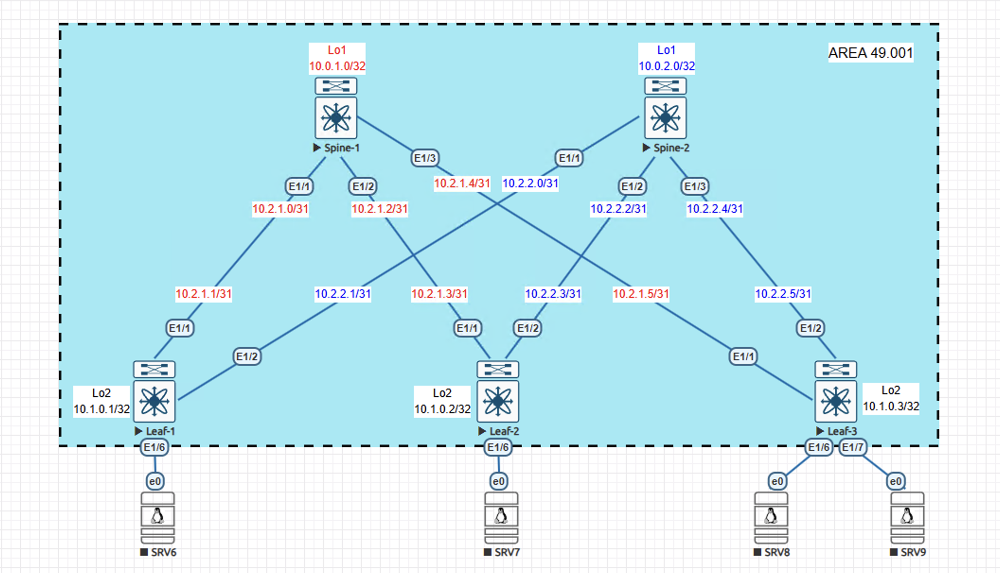

# Домашнее задание №3
## Underlay. IS-IS

### Задание:
- Настроите IS-IS в Underlay сети, для IP связанности между всеми сетевыми устройствами;
- Убедиться в наличии IP связанности между устройствами в IS-IS домене.

## Выполнение:

### Собранная схема сети



### Конфигурация устройств:

#### - [Spine-1](Config/Spine-1)
```
hostname Spine-1
feature ospf

interface Ethernet1/1
  description -- DownLink Leaf-1-e1/1
  no switchport
  mtu 9000
  no ip redirects
  ip address 10.2.1.0/31
  isis network point-to-point
  isis circuit-type level-1
  ip router isis UNDERLAY
  no isis passive-interface level-1
  no shutdown

interface Ethernet1/2
  description -- DownLink Leaf-2-e1/1
  no switchport
  mtu 9000
  no ip redirects
  ip address 10.2.1.2/31
  isis network point-to-point
  isis circuit-type level-1
  ip router isis UNDERLAY
  no isis passive-interface level-1
  no shutdown

interface Ethernet1/3
  description -- DownLink Leaf-3-e1/1
  no switchport
  mtu 9000
  no ip redirects
  ip address 10.2.1.4/31
  isis network point-to-point
  isis circuit-type level-1
  ip router isis UNDERLAY
  no isis passive-interface level-1
  no shutdown

interface loopback1
  ip address 10.0.1.0/32
  ip router isis UNDERLAY

router isis UNDERLAY
  net 49.0001.0001.0001.1001.00
  address-family ipv4 unicast
  passive-interface default level-1
```

```
hostname Spine-2
feature isis

interface Ethernet1/1
  description -- DownLink Leaf-1-e1/2
  no switchport
  mtu 9000
  no ip redirects
  ip address 10.2.2.0/31
  isis network point-to-point
  isis circuit-type level-1
  ip router isis UNDERLAY
  no isis passive-interface level-1
  no shutdown

interface Ethernet1/2
  description -- DownLink Leaf-2-e1/2
  no switchport
  mtu 9000
  no ip redirects
  ip address 10.2.2.2/31
  isis network point-to-point
  isis circuit-type level-1
  ip router isis UNDERLAY
  no isis passive-interface level-1
  no shutdown

interface Ethernet1/3
  description -- DownLink Leaf-2-e1/3
  no switchport
  mtu 9000
  no ip redirects
  ip address 10.2.2.4/31
  isis network point-to-point
  isis circuit-type level-1
  ip router isis UNDERLAY
  no isis passive-interface level-1
  no shutdown

interface loopback1
  ip address 10.0.2.0/32
  ip router isis UNDERLAY

router isis UNDERLAY
  net 49.0001.0001.0001.1002.00
  address-family ipv4 unicast
  passive-interface default level-1
```

```
hostname Leaf-1
feature isis

interface Ethernet1/1
  description -- UpLink Spine-1-e1/1
  no switchport
  mtu 9000
  no ip redirects
  ip address 10.2.1.1/31
  isis network point-to-point
  isis circuit-type level-1
  ip router isis UNDERLAY
  no isis passive-interface level-1
  no shutdown

interface Ethernet1/2
  description -- DownLink Spine-2-e1/1
  no switchport
  mtu 9000
  no ip redirects
  ip address 10.2.2.1/31
  isis network point-to-point
  isis circuit-type level-1
  ip router isis UNDERLAY
  no isis passive-interface level-1
  no shutdown

interface loopback2
  ip address 10.1.0.1/32
  ip router isis UNDERLAY

router isis UNDERLAY
  net 49.0001.0001.0001.0001.00
  address-family ipv4 unicast
  passive-interface default level-1
```

```
hostname Leaf-2
feature isis

interface Ethernet1/1
  description -- UpLink Spine-1-e1/2
  no switchport
  mtu 9000
  no ip redirects
  ip address 10.2.1.3/31
  isis network point-to-point
  isis circuit-type level-1
  ip router isis UNDERLAY
  no isis passive-interface level-1
  no shutdown

interface Ethernet1/2
  description -- DownLink Spine-2-e1/2
  no switchport
  mtu 9000
  no ip redirects
  ip address 10.2.2.3/31
  isis network point-to-point
  isis circuit-type level-1
  ip router isis UNDERLAY
  no isis passive-interface level-1
  no shutdown

interface loopback2
  ip address 10.1.0.2/32
  ip router isis UNDERLAY

router isis UNDERLAY
  net 49.0001.0001.0001.0002.00
  address-family ipv4 unicast
  passive-interface default level-1
```

```
hostname Leaf-3
feature isis

interface Ethernet1/1
  description -- UpLink Spine-1-e1/3
  no switchport
  mtu 9000
  no ip redirects
  ip address 10.2.1.5/31
  isis network point-to-point
  isis circuit-type level-1
  ip router isis UNDERLAY
  no isis passive-interface level-1
  no shutdown

interface Ethernet1/2
  description -- DownLink Spine-2-e1/3
  no switchport
  mtu 9000
  no ip redirects
  ip address 10.2.2.5/31
  isis network point-to-point
  isis circuit-type level-1
  ip router isis UNDERLAY
  no isis passive-interface level-1
  no shutdown

interface loopback2
  ip address 10.1.0.3/32
  ip router isis UNDERLAY

router isis UNDERLAY
  net 49.0001.0001.0001.0003.00
  address-family ipv4 unicast
  passive-interface default level-1
```

### Таблицы Маршрутизации и Соседства:
- Spine-1
```
Spine-1# sho isis interf b
IS-IS process: UNDERLAY VRF: default
Interface    Type  Idx State        Circuit   MTU  Metric  Priority  Adjs/AdjsUp
                                                   L1  L2  L1  L2    L1    L2
--------------------------------------------------------------------------------
Topology: TopoID: 0
loopback1    Loop  1     Up/Ready   0x01/L1-2 1500 1   1   64  64    0/0   0/0
Topology: TopoID: 0
Ethernet1/1  P2P   2     Up/Ready   0x01/L1   9000 40  40  64  64    1/1   0/0
Topology: TopoID: 0
Ethernet1/2  P2P   3     Up/Ready   0x01/L1   9000 40  40  64  64    1/1   0/0
Topology: TopoID: 0
Ethernet1/3  P2P   4     Up/Ready   0x01/L1   9000 40  40  64  64    1/1   0/0
```

```
Spine-1# sho ip route isis-UNDERLAY
IP Route Table for VRF "default"
'*' denotes best ucast next-hop
'**' denotes best mcast next-hop
'[x/y]' denotes [preference/metric]
'%<string>' in via output denotes VRF <string>

10.0.2.0/32, ubest/mbest: 3/0
    *via 10.2.1.1, Eth1/1, [115/81], 00:21:03, isis-UNDERLAY, L1
    *via 10.2.1.3, Eth1/2, [115/81], 00:21:00, isis-UNDERLAY, L1
    *via 10.2.1.5, Eth1/3, [115/81], 00:20:54, isis-UNDERLAY, L1
10.1.0.1/32, ubest/mbest: 1/0
    *via 10.2.1.1, Eth1/1, [115/41], 00:21:03, isis-UNDERLAY, L1
10.1.0.2/32, ubest/mbest: 1/0
    *via 10.2.1.3, Eth1/2, [115/41], 00:21:00, isis-UNDERLAY, L1
10.1.0.3/32, ubest/mbest: 1/0
    *via 10.2.1.5, Eth1/3, [115/41], 00:20:54, isis-UNDERLAY, L1
10.2.2.0/31, ubest/mbest: 1/0
    *via 10.2.1.1, Eth1/1, [115/80], 00:21:03, isis-UNDERLAY, L1
10.2.2.2/31, ubest/mbest: 1/0
    *via 10.2.1.3, Eth1/2, [115/80], 00:21:00, isis-UNDERLAY, L1
10.2.2.4/31, ubest/mbest: 1/0
    *via 10.2.1.5, Eth1/3, [115/80], 00:20:54, isis-UNDERLAY, L1
```

- Spine-2
```
Spine-2# show isis interf brief
IS-IS process: UNDERLAY VRF: default
Interface    Type  Idx State        Circuit   MTU  Metric  Priority  Adjs/AdjsUp
                                                   L1  L2  L1  L2    L1    L2
--------------------------------------------------------------------------------
Topology: TopoID: 0
loopback1    Loop  1     Up/Ready   0x01/L1-2 1500 1   1   64  64    0/0   0/0
Topology: TopoID: 0
Ethernet1/1  P2P   2     Up/Ready   0x01/L1   9000 40  40  64  64    1/1   0/0
Topology: TopoID: 0
Ethernet1/2  P2P   3     Up/Ready   0x01/L1   9000 40  40  64  64    1/1   0/0
Topology: TopoID: 0
Ethernet1/3  P2P   4     Up/Ready   0x01/L1   9000 40  40  64  64    1/1   0/0
```
```
Spine-2# show ip route isis-UNDERLAY
IP Route Table for VRF "default"
'*' denotes best ucast next-hop
'**' denotes best mcast next-hop
'[x/y]' denotes [preference/metric]
'%<string>' in via output denotes VRF <string>

10.0.1.0/32, ubest/mbest: 3/0
    *via 10.2.2.1, Eth1/1, [115/81], 00:23:15, isis-UNDERLAY, L1
    *via 10.2.2.3, Eth1/2, [115/81], 00:23:12, isis-UNDERLAY, L1
    *via 10.2.2.5, Eth1/3, [115/81], 00:23:06, isis-UNDERLAY, L1
10.1.0.1/32, ubest/mbest: 1/0
    *via 10.2.2.1, Eth1/1, [115/41], 00:23:16, isis-UNDERLAY, L1
10.1.0.2/32, ubest/mbest: 1/0
    *via 10.2.2.3, Eth1/2, [115/41], 00:23:13, isis-UNDERLAY, L1
10.1.0.3/32, ubest/mbest: 1/0
    *via 10.2.2.5, Eth1/3, [115/41], 00:23:06, isis-UNDERLAY, L1
10.2.1.0/31, ubest/mbest: 1/0
    *via 10.2.2.1, Eth1/1, [115/80], 00:23:16, isis-UNDERLAY, L1
10.2.1.2/31, ubest/mbest: 1/0
    *via 10.2.2.3, Eth1/2, [115/80], 00:23:13, isis-UNDERLAY, L1
10.2.1.4/31, ubest/mbest: 1/0
    *via 10.2.2.5, Eth1/3, [115/80], 00:23:06, isis-UNDERLAY, L1
```

- Leaf-1
```
Leaf-1# show isis interf b
IS-IS process: UNDERLAY VRF: default
Interface    Type  Idx State        Circuit   MTU  Metric  Priority  Adjs/AdjsUp
                                                   L1  L2  L1  L2    L1    L2
--------------------------------------------------------------------------------
Topology: TopoID: 0
loopback2    Loop  1     Up/Ready   0x01/L1-2 1500 1   1   64  64    0/0   0/0
Topology: TopoID: 0
Ethernet1/1  P2P   2     Up/Ready   0x01/L1   9000 40  40  64  64    1/1   0/0
Topology: TopoID: 0
Ethernet1/2  P2P   3     Up/Ready   0x01/L1   9000 40  40  64  64    1/1   0/0
```
```
Leaf-1# show ip route isis-UNDERLAY
IP Route Table for VRF "default"
'*' denotes best ucast next-hop
'**' denotes best mcast next-hop
'[x/y]' denotes [preference/metric]
'%<string>' in via output denotes VRF <string>

10.0.1.0/32, ubest/mbest: 1/0
    *via 10.2.1.0, Eth1/1, [115/41], 00:24:28, isis-UNDERLAY, L1
10.0.2.0/32, ubest/mbest: 1/0
    *via 10.2.2.0, Eth1/2, [115/41], 00:24:28, isis-UNDERLAY, L1
10.1.0.2/32, ubest/mbest: 2/0
    *via 10.2.1.0, Eth1/1, [115/81], 00:24:28, isis-UNDERLAY, L1
    *via 10.2.2.0, Eth1/2, [115/81], 00:24:28, isis-UNDERLAY, L1
10.1.0.3/32, ubest/mbest: 2/0
    *via 10.2.1.0, Eth1/1, [115/81], 00:24:17, isis-UNDERLAY, L1
    *via 10.2.2.0, Eth1/2, [115/81], 00:24:17, isis-UNDERLAY, L1
10.2.1.2/31, ubest/mbest: 1/0
    *via 10.2.1.0, Eth1/1, [115/80], 00:24:28, isis-UNDERLAY, L1
10.2.1.4/31, ubest/mbest: 1/0
    *via 10.2.1.0, Eth1/1, [115/80], 00:24:28, isis-UNDERLAY, L1
10.2.2.2/31, ubest/mbest: 1/0
    *via 10.2.2.0, Eth1/2, [115/80], 00:24:28, isis-UNDERLAY, L1
10.2.2.4/31, ubest/mbest: 1/0
    *via 10.2.2.0, Eth1/2, [115/80], 00:24:28, isis-UNDERLAY, L1
```

- Leaf-2
```
Leaf-2#  show isis interf b
IS-IS process: UNDERLAY VRF: default
Interface    Type  Idx State        Circuit   MTU  Metric  Priority  Adjs/AdjsUp
                                                   L1  L2  L1  L2    L1    L2
--------------------------------------------------------------------------------
Topology: TopoID: 0
loopback2    Loop  1     Up/Ready   0x01/L1-2 1500 1   1   64  64    0/0   0/0
Topology: TopoID: 0
Ethernet1/1  P2P   2     Up/Ready   0x01/L1   9000 40  40  64  64    1/1   0/0
Topology: TopoID: 0
Ethernet1/2  P2P   3     Up/Ready   0x01/L1   9000 40  40  64  64    1/1   0/0
```
```
Leaf-2# show ip route isis-UNDERLAY
IP Route Table for VRF "default"
'*' denotes best ucast next-hop
'**' denotes best mcast next-hop
'[x/y]' denotes [preference/metric]
'%<string>' in via output denotes VRF <string>

10.0.1.0/32, ubest/mbest: 1/0
    *via 10.2.1.2, Eth1/1, [115/41], 00:25:13, isis-UNDERLAY, L1
10.0.2.0/32, ubest/mbest: 1/0
    *via 10.2.2.2, Eth1/2, [115/41], 00:25:13, isis-UNDERLAY, L1
10.1.0.1/32, ubest/mbest: 2/0
    *via 10.2.1.2, Eth1/1, [115/81], 00:25:13, isis-UNDERLAY, L1
    *via 10.2.2.2, Eth1/2, [115/81], 00:25:13, isis-UNDERLAY, L1
10.1.0.3/32, ubest/mbest: 2/0
    *via 10.2.1.2, Eth1/1, [115/81], 00:25:04, isis-UNDERLAY, L1
    *via 10.2.2.2, Eth1/2, [115/81], 00:25:04, isis-UNDERLAY, L1
10.2.1.0/31, ubest/mbest: 1/0
    *via 10.2.1.2, Eth1/1, [115/80], 00:25:13, isis-UNDERLAY, L1
10.2.1.4/31, ubest/mbest: 1/0
    *via 10.2.1.2, Eth1/1, [115/80], 00:25:13, isis-UNDERLAY, L1
10.2.2.0/31, ubest/mbest: 1/0
    *via 10.2.2.2, Eth1/2, [115/80], 00:25:13, isis-UNDERLAY, L1
10.2.2.4/31, ubest/mbest: 1/0
    *via 10.2.2.2, Eth1/2, [115/80], 00:25:13, isis-UNDERLAY, L1
```

- Leaf-3
```
Leaf-3#  show isis interf b
IS-IS process: UNDERLAY VRF: default
Interface    Type  Idx State        Circuit   MTU  Metric  Priority  Adjs/AdjsUp
                                                   L1  L2  L1  L2    L1    L2
--------------------------------------------------------------------------------
Topology: TopoID: 0
loopback2    Loop  1     Up/Ready   0x01/L1-2 1500 1   1   64  64    0/0   0/0
Topology: TopoID: 0
Ethernet1/1  P2P   2     Up/Ready   0x01/L1   9000 40  40  64  64    1/1   0/0
Topology: TopoID: 0
Ethernet1/2  P2P   3     Up/Ready   0x01/L1   9000 40  40  64  64    1/1   0/0
```
```
Leaf-3# show ip route isis-UNDERLAY
IP Route Table for VRF "default"
'*' denotes best ucast next-hop
'**' denotes best mcast next-hop
'[x/y]' denotes [preference/metric]
'%<string>' in via output denotes VRF <string>

10.0.1.0/32, ubest/mbest: 1/0
    *via 10.2.1.4, Eth1/1, [115/41], 00:26:10, isis-UNDERLAY, L1
10.0.2.0/32, ubest/mbest: 1/0
    *via 10.2.2.4, Eth1/2, [115/41], 00:26:09, isis-UNDERLAY, L1
10.1.0.1/32, ubest/mbest: 2/0
    *via 10.2.1.4, Eth1/1, [115/81], 00:26:09, isis-UNDERLAY, L1
    *via 10.2.2.4, Eth1/2, [115/81], 00:26:09, isis-UNDERLAY, L1
10.1.0.2/32, ubest/mbest: 2/0
    *via 10.2.1.4, Eth1/1, [115/81], 00:26:09, isis-UNDERLAY, L1
    *via 10.2.2.4, Eth1/2, [115/81], 00:26:09, isis-UNDERLAY, L1
10.2.1.0/31, ubest/mbest: 1/0
    *via 10.2.1.4, Eth1/1, [115/80], 00:26:10, isis-UNDERLAY, L1
10.2.1.2/31, ubest/mbest: 1/0
    *via 10.2.1.4, Eth1/1, [115/80], 00:26:10, isis-UNDERLAY, L1
10.2.2.0/31, ubest/mbest: 1/0
    *via 10.2.2.4, Eth1/2, [115/80], 00:26:09, isis-UNDERLAY, L1
10.2.2.2/31, ubest/mbest: 1/0
    *via 10.2.2.4, Eth1/2, [115/80], 00:26:09, isis-UNDERLAY, L1
```

### Проверка связности:
- Spine-1
```
Spine-1# ping 10.0.2.0
PING 10.0.2.0 (10.0.2.0): 56 data bytes
64 bytes from 10.0.2.0: icmp_seq=0 ttl=253 time=16.231 ms
64 bytes from 10.0.2.0: icmp_seq=1 ttl=253 time=4.818 ms
64 bytes from 10.0.2.0: icmp_seq=2 ttl=253 time=2.922 ms
64 bytes from 10.0.2.0: icmp_seq=3 ttl=253 time=3.667 ms
64 bytes from 10.0.2.0: icmp_seq=4 ttl=253 time=5.799 ms

--- 10.0.2.0 ping statistics ---
5 packets transmitted, 5 packets received, 0.00% packet loss
round-trip min/avg/max = 2.922/6.687/16.231 ms
```
```
Spine-1# ping 10.1.0.1
PING 10.1.0.1 (10.1.0.1): 56 data bytes
64 bytes from 10.1.0.1: icmp_seq=0 ttl=254 time=33.654 ms
64 bytes from 10.1.0.1: icmp_seq=1 ttl=254 time=2.122 ms
64 bytes from 10.1.0.1: icmp_seq=2 ttl=254 time=1.486 ms
64 bytes from 10.1.0.1: icmp_seq=3 ttl=254 time=1.49 ms
64 bytes from 10.1.0.1: icmp_seq=4 ttl=254 time=1.759 ms

--- 10.1.0.1 ping statistics ---
5 packets transmitted, 5 packets received, 0.00% packet loss
round-trip min/avg/max = 1.486/8.102/33.654 ms
```
```
Spine-1# ping 10.1.0.2
PING 10.1.0.2 (10.1.0.2): 56 data bytes
64 bytes from 10.1.0.2: icmp_seq=0 ttl=254 time=15.897 ms
64 bytes from 10.1.0.2: icmp_seq=1 ttl=254 time=1.941 ms
64 bytes from 10.1.0.2: icmp_seq=2 ttl=254 time=3.643 ms
64 bytes from 10.1.0.2: icmp_seq=3 ttl=254 time=1.658 ms
64 bytes from 10.1.0.2: icmp_seq=4 ttl=254 time=1.96 ms

--- 10.1.0.2 ping statistics ---
5 packets transmitted, 5 packets received, 0.00% packet loss
round-trip min/avg/max = 1.658/5.019/15.897 ms
```
```
Spine-1# ping 10.1.0.3
PING 10.1.0.3 (10.1.0.3): 56 data bytes
64 bytes from 10.1.0.3: icmp_seq=0 ttl=254 time=18.749 ms
64 bytes from 10.1.0.3: icmp_seq=1 ttl=254 time=1.876 ms
64 bytes from 10.1.0.3: icmp_seq=2 ttl=254 time=1.776 ms
64 bytes from 10.1.0.3: icmp_seq=3 ttl=254 time=1.537 ms
64 bytes from 10.1.0.3: icmp_seq=4 ttl=254 time=1.397 ms

--- 10.1.0.3 ping statistics ---
5 packets transmitted, 5 packets received, 0.00% packet loss
round-trip min/avg/max = 1.397/5.066/18.749 ms
```

- Leaf-1
```
Leaf-1# ping 10.0.2.0
PING 10.0.2.0 (10.0.2.0): 56 data bytes
64 bytes from 10.0.2.0: icmp_seq=0 ttl=254 time=5.012 ms
64 bytes from 10.0.2.0: icmp_seq=1 ttl=254 time=1.81 ms
64 bytes from 10.0.2.0: icmp_seq=2 ttl=254 time=1.598 ms
64 bytes from 10.0.2.0: icmp_seq=3 ttl=254 time=1.416 ms
64 bytes from 10.0.2.0: icmp_seq=4 ttl=254 time=1.727 ms

--- 10.0.2.0 ping statistics ---
5 packets transmitted, 5 packets received, 0.00% packet loss
round-trip min/avg/max = 1.416/2.312/5.012 ms
```
```
Leaf-1# ping 10.1.0.2
PING 10.1.0.2 (10.1.0.2): 56 data bytes
64 bytes from 10.1.0.2: icmp_seq=0 ttl=253 time=11.133 ms
64 bytes from 10.1.0.2: icmp_seq=1 ttl=253 time=5.925 ms
64 bytes from 10.1.0.2: icmp_seq=2 ttl=253 time=3.826 ms
64 bytes from 10.1.0.2: icmp_seq=3 ttl=253 time=7.721 ms
64 bytes from 10.1.0.2: icmp_seq=4 ttl=253 time=7.157 ms

--- 10.1.0.2 ping statistics ---
5 packets transmitted, 5 packets received, 0.00% packet loss
round-trip min/avg/max = 3.826/7.152/11.133 ms
```
```
Leaf-1# ping 10.1.0.3
PING 10.1.0.3 (10.1.0.3): 56 data bytes
64 bytes from 10.1.0.3: icmp_seq=0 ttl=253 time=6.305 ms
64 bytes from 10.1.0.3: icmp_seq=1 ttl=253 time=4.505 ms
64 bytes from 10.1.0.3: icmp_seq=2 ttl=253 time=6.69 ms
64 bytes from 10.1.0.3: icmp_seq=3 ttl=253 time=6.062 ms
64 bytes from 10.1.0.3: icmp_seq=4 ttl=253 time=9.15 ms

--- 10.1.0.3 ping statistics ---
5 packets transmitted, 5 packets received, 0.00% packet loss
round-trip min/avg/max = 4.505/6.542/9.15 ms
```
